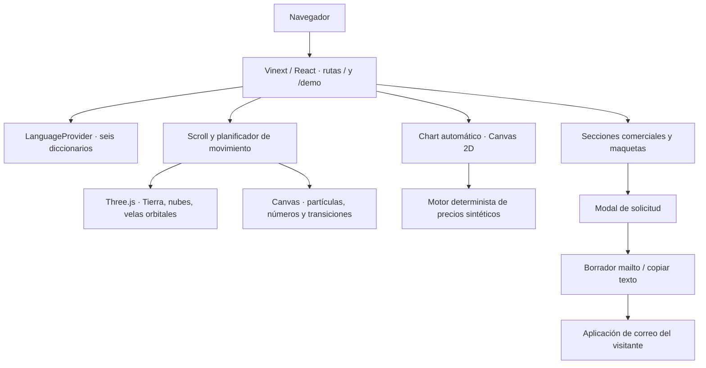

# Arquitectura y esqueleto del website

## Capas

El Worker entrega la aplicación y los recursos. Los efectos, el chart y el formulario se ejecutan en el navegador. No existe una llamada a un broker, endpoint de ejecución, base de datos de usuarios o API de mercado. El único dato persistido por el website es la preferencia local de idioma; el borrador de solicitud vive en el estado del componente.

## Mapa de módulos

| Módulo en src/app | Responsabilidad |
|---|---|
| layout.tsx / fonts.css | Metadatos, viewport, estilos y fuentes locales |
| page.tsx | Landing completa, anchors, reparto, pausa global y apertura del modal |
| demo/page.tsx | Página dedicada al chart automático |
| brand.tsx / brand-palette.css | Logo y nombre reutilizables con colores oficiales |
| product-showcase.tsx / .css | Laptop y teléfono ilustrativos, cambios de vista e interacción |
| product-chart.tsx | Chart de la maqueta del producto |
| earth-scene.tsx | WebGL, cámara, geometrías, shaders, luces urbanas y texturas |
| world-journey.ts | Mezcla continua de escenas según posición de scroll |
| world-atmosphere.ts | Dibujo de campos y partículas de fondo |
| number-field.tsx | Campo de números y composición de transición |
| smoke-atmosphere.tsx | Atmósfera de humo |
| motion-loop.ts | Bucle compartido, pausas, visibilidad y limpieza |
| experience-demo.tsx | Contenedor mínimo del chart automático |
| trade-simulator.tsx | Canvas, control de pausa y estado visible de la simulación |
| trade-simulation.ts | Velas, precios deterministas, TP/SL y dibujo |
| access-request.tsx | Validación, composición mailto y copia del borrador |
| access-details.tsx | Condiciones informativas desplegables |
| operating-principles.tsx | Principios y límites expresados en la landing |
| site-language.tsx / locales | Estado, carga, recuperación y selector de idioma |
| automation-story.tsx | Componente histórico conservado; no es la simulación activa |

La biblioteca `src/components/ui/` y sus helpers se entrega completa porque forma parte del repositorio. No todos sus componentes se montan en la landing. No elimines paquetes o componentes para la primera reproducción; primero confirma qué imports usa un cambio.

## Rutas y navegación

`/` incluye `#inicio`, `#producto`, `#como-funciona`, `#requisitos`, `#reparto`, `#condiciones` y `#acceso`. `/demo` muestra únicamente la simulación y su navegación. Los enlaces de fuentes NASA/NinjaTrader salen a referencias externas; no conectan una cuenta.

## Datos de la solicitud

Nombre (2–80 caracteres), correo (hasta 140), experiencia, disponibilidad de PC Windows, modalidad, motivo (15–1200) y reconocimiento requerido. Al continuar se crea un `mailto:` a cjar292@gmail.com. Se muestra un borrador copiable si el cliente de correo no abre. Cerrar, Escape o el fondo del diálogo cierran el modal. No se firma contrato ni se cobra.

## Construcción

React 19, TypeScript, Vinext, Vite, Three.js, Lucide y estilos CSS/Tailwind. Versiones resueltas en el lockfile. `vite.config.ts` conserva las integraciones Sites y Workers. No hay migraciones SQL ni almacenamiento R2/D1 configurado.
